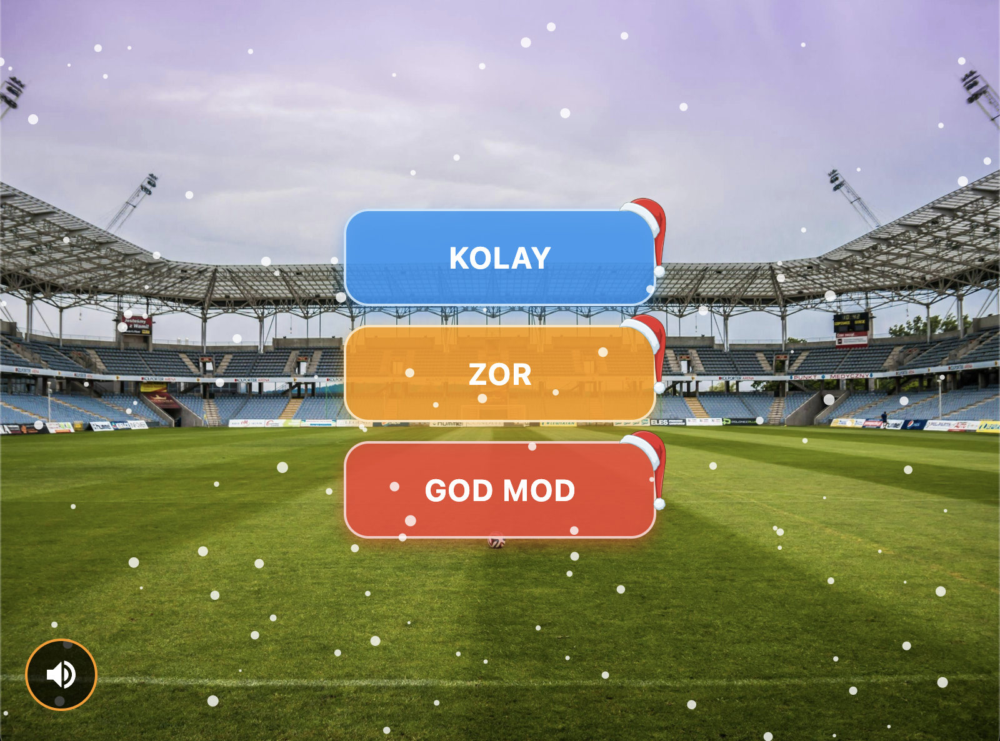
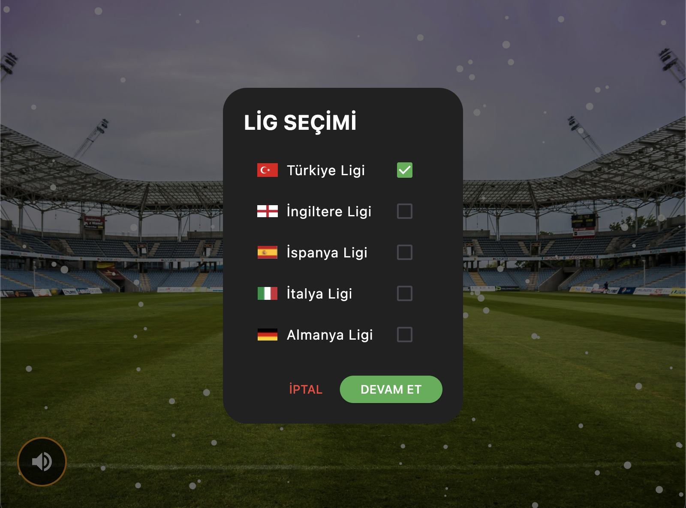
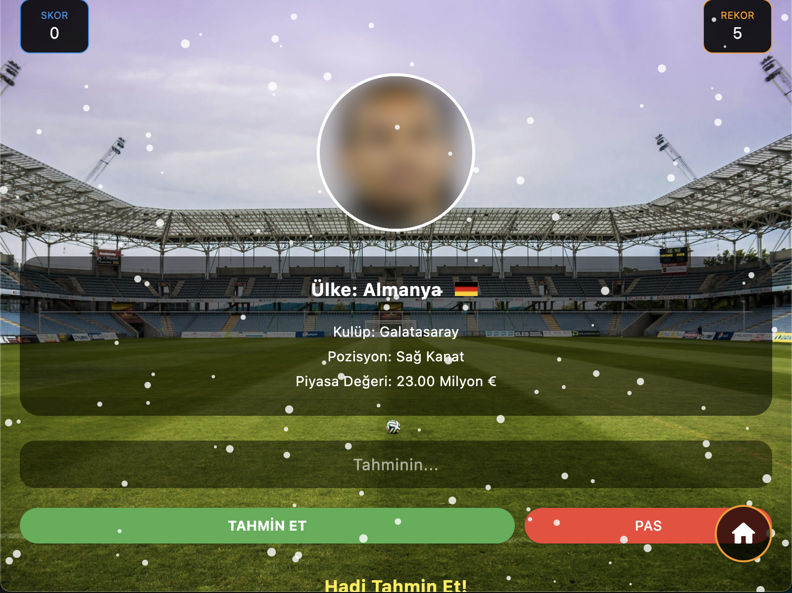

# ⚽ Futbolcu Tahmin Oyunu (Footballer Guessing Game)

Bu proje; mobil oyun geliştirme (**Flutter**) ve veri mühendisliği/otomasyonu (**Python Web Scraping**) disiplinlerini bir araya getiren dinamik bir futbolcu tahmin oyunudur. Kullanıcılar seçtikleri liglere göre gelen futbolcuların kulüp, mevki, piyasa değeri ve ülke bayrağı ipuçlarını kullanarak futbolcunun kim olduğunu tahmin etmeye çalışırlar.

BATUHAN PAMUK 24010501125

---

## 📸 Ekran Görüntüleri / Screenshots

| Ana Menü & Mod Seçimi | Lig Seçimi | Oyun İçeriği |
| --- | --- | --- |
|  |  |  |

---

## 🚀 Öne Çıkan Özellikler (Features)

- 🏆 **3 Farklı Zorluk Modu:** Kolay (Easy), Zor (Hard) ve God Mod (God Mode) ile piyasa değerine göre filtrelenen dinamik zorluk seviyeleri.
- ⏱️ **Zaman Sınırı ve Pas Hakkı:** Zor ve God Mod'da 10 saniyelik geri sayım sayacı ve sınırlı pas hakkı.
- 🌍 **Dinamik Lig Seçimi:** Türkiye, İngiltere, İspanya, İtalya ve Almanya Liglerini tek tek veya çoklu seçerek havuzu kişiselleştirme.
- ⚡ **Akıllı Arama / Toleranslı Giriş:** Türkçe karakter ve aksanlı harf duyarlılığı temizleyicisi sayesinde oyuncu isimlerindeki aksan ve Türkçe karakter hatalarını (örneğin: `á`, `ü`, `ş` -> `a`, `u`, `s`) otomatik tolere eden doğrulama mantığı.
- ❄️ **Zengin Tasarım & Animasyonlar:** Gerçekçi kış temalı kar yağışı animasyonu (`SnowfallWidget`) ve özel tasarım buton süslemeleri.
- 🎶 **Müzik ve Ses Kontrolü:** Arka planda döngü halinde çalan kış temalı müzik ve sol alt köşeden tek tıkla sesi açma/kapatma (mute) desteği.
- 📊 **Firebase Liderlik Tablosu (Leaderboard):** Kolay, Zor ve God Mod rekorlarını Firebase Firestore entegrasyonu ile dünya genelindeki oyuncularla paylaşma ve sıralama.
- 💾 **Yerel Rekor Kaydı (SharedPreferences):** İnternet olmasa dahi cihaz üzerinde en yüksek skorları saklama.

---

## 🛠️ Kullanılan Teknolojiler (Tech Stack)

### Mobil Uygulama (Flutter / Dart)
- **State Management:** `StatefulWidget` ve optimize edilmiş UI güncellemeleri
- **Database / Backend:** Firebase Core & Cloud Firestore (Çevrimiçi Sıralama Tablosu)
- **Local Storage:** `shared_preferences` (Kullanıcı rekorları)
- **Audio:** `audioplayers` (Arka plan müzik kontrolü)
- **UI & Animations:** Custom Canvas tabanlı kar yağışı animasyon sistemi (`SnowfallWidget`)

### Veri Otomasyonu (Python)
- **Scraping:** `requests`, `BeautifulSoup` (Transfermarkt üzerinden güncel futbolcu verilerini çekme)
- **Data Engineering:** Otomatik ülke-bayrak eşleme, piyasa değeri normalizasyonu, veri doğrulama ve bozuk görsel linklerini temizleme araçları.

---

## 📂 Proje Yapısı (Project Architecture)

```text
├── lib/
│   ├── screens/
│   │   └── leaderboard_screen.dart   # Firestore dünya sıralaması ekranı
│   ├── services/
│   │   └── leaderboard_service.dart   # Firebase Firestore CRUD işlemleri
│   ├── futbolcu.dart                 # Futbolcu veri modeli ve JSON parser
│   ├── tahmin_oyunu.dart             # Ana oyun mekaniği, klavye yönetimi ve UI
│   ├── snow_animation.dart           # Kar animasyonu CustomPainter motoru
│   └── main.dart                     # Flutter giriş noktası
│
├── assets/
│   ├── data/futbolcular.json         # Python tarafından hazırlanan dinamik veri havuzu
│   ├── flags/                        # Ülke bayrakları (PNG formatında)
│   ├── players/                      # Futbolcu profil fotoğrafları
│   └── music/                        # Arka plan müzikleri
│
└── Python Scripts (Kök Dizinde):
    ├── add_german_teams.py           # Almanya Ligi takımlarını ve oyuncularını çeker
    ├── add_italian_teams.py          # İtalya Ligi takımlarını ve oyuncularını çeker
    ├── download_german_photos.py     # Alman ligi oyuncu fotoğraflarını indirir
    ├── download_italian_photos.py     # İtalyan ligi oyuncu fotoğraflarını indirir
    ├── verify_players.py             # Veritabanı bütünlüğünü kontrol eder
    └── fix_flags.py                  # Eksik bayrak eşleşmelerini düzeltir
```

---

## 💻 Kurulum ve Çalıştırma (How to Run)

### 1. Flutter Uygulamasını Çalıştırma

1. Flutter SDK'nın bilgisayarınızda kurulu olduğundan emin olun.
2. Bağımlılıkları yükleyin:
   ```bash
   flutter pub get
   ```
3. Bir emülatör başlatın veya cihazınızı bağlayıp uygulamayı çalıştırın:
   ```bash
   flutter run
   ```

*(Not: Dünya sıralaması özelliğinin çalışabilmesi için kendi Firebase projenizi oluşturup `google-services.json` (Android) ve `GoogleService-Info.plist` (iOS) dosyalarını eklemeniz gerekmektedir.)*

### 2. Python Veri Otomasyon Araçlarını Kullanma (İsteğe Bağlı)

Eğer veri havuzunu güncellemek veya yeni oyuncular/ligler eklemek isterseniz:

1. Gerekli Python kütüphanelerini yükleyin:
   ```bash
   pip install requests beautifulsoup4
   ```
2. Lig verilerini çekmek için scriptleri çalıştırın:
   ```bash
   python3 add_german_teams.py
   python3 download_german_photos.py
   ```
